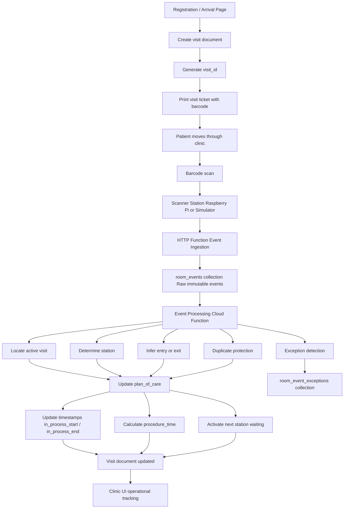

# Barcode Patient Flow System

## Architecture Overview

This document provides a high-level view of the barcode-driven patient
workflow system used in Clínica Alfarero.

The goal of the system is to automatically track patient progress
through clinic services using barcode scans.

---

# System Architecture Diagram

---

# Core Components

## Registration System

The registration page performs the following actions:

- creates the visit document\
- generates a unique visit_id\
- prints the visit ticket

The visit ticket contains the barcode used throughout the clinic.

---

## Visit Ticket

The printed ticket contains:

- patient name\
- visit identifier\
- visit barcode\
- basic visit information

Example barcode payload:

VISIT:abc123

The barcode identifies the visit, not the patient.

---

## Scanner Station

A scanner station reads the visit barcode and submits scan events.

Initial implementation:

- Raspberry Pi\
- USB barcode scanner\
- WiFi network connection

The station adds metadata to each scan:

- station_id\
- room_id\
- scanner_id

---

## Event Ingestion

Scan events are submitted to an HTTP Cloud Function.

The function writes the event to:

room_events

This collection contains immutable raw scan events.

Example fields:

- event_type\
- visit_id\
- station_id\
- room_id\
- scanner_id\
- timestamp_utc\
- received_at

---

## Backend Event Processor

A Cloud Function processes newly created room_events.

Responsibilities:

1.  locate the active visit\
2.  determine the station involved\
3.  determine entry or exit action\
4.  update the visit plan_of_care\
5.  record timing metrics\
6.  detect invalid transitions

---

## Plan of Care Updates

The processor updates the visit document.

Typical updates include:

- setting in_process_start\
- setting in_process_end\
- calculating procedure_time\
- updating station status\
- advancing the next station to waiting

---

## Exception Handling

Operational problems are recorded in:

room_event_exceptions

Examples:

- visit not found\
- station mismatch\
- duplicate scan\
- invalid state transition\
- scan on completed visit

This allows the clinic team to review operational anomalies.

---

# Simplified System Flow

Registration ↓ Create visit ↓ Generate visit_id ↓ Print visit ticket ↓
Patient arrives at station ↓ Barcode scanned ↓ Scanner station sends
event ↓ Event stored in room_events ↓ Cloud Function processes event ↓
Visit plan_of_care updated ↓ Clinic UI reflects new status

If an error occurs:

Cloud Function ↓ Record issue in room_event_exceptions

---

# Purpose of the Architecture Diagram

This document helps developers and clinic staff quickly understand:

- how visits are created\
- how barcode scans enter the system\
- how backend processing updates patient workflow\
- how exceptions are captured for review

It serves as a high-level reference alongside the detailed specification
in:

docs/workflow-spec.md
