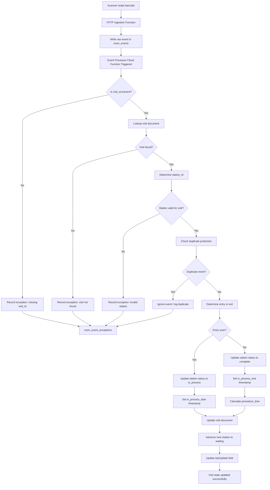

# Event Processing Flow

Clínica Alfarero --- Barcode Patient Flow System

This document describes the backend logic used to process `room_events`
and update a patient's visit document.

Note: Laboratory (`lab`) and Pharmacy (`pha`) may require manual routing by the anfitrión.
If both remain active in the visit plan, automatic promotion does not occur.

---

## Event Processing Diagram

---

## Processing Responsibilities

The backend processor performs the following steps:

1.  Validate event payload
2.  Locate the active visit
3.  Verify station information
4.  Apply duplicate protection
5.  Determine entry or exit
6.  Update `plan_of_care`
7.  Record timing metrics
8.  Advance the next station
9.  Log exceptions if necessary

---

## Key Collections

### room_events

Stores immutable raw scan events.

Typical fields:

- event_type
- visit_id
- station_id
- room_id
- scanner_id
- timestamp_utc
- received_at

---

### visits (patient visit documents)

Contains:

- visit metadata
- patient information
- `plan_of_care`
- operational timestamps

---

### room_event_exceptions

Stores errors and anomalies during event processing.

Examples:

- visit not found
- invalid station
- duplicate scan
- missing data
- invalid transition

---

## Purpose

This flow ensures:

- raw events are always preserved
- visit updates are deterministic
- operational errors are observable
- the clinic workflow remains auditable
