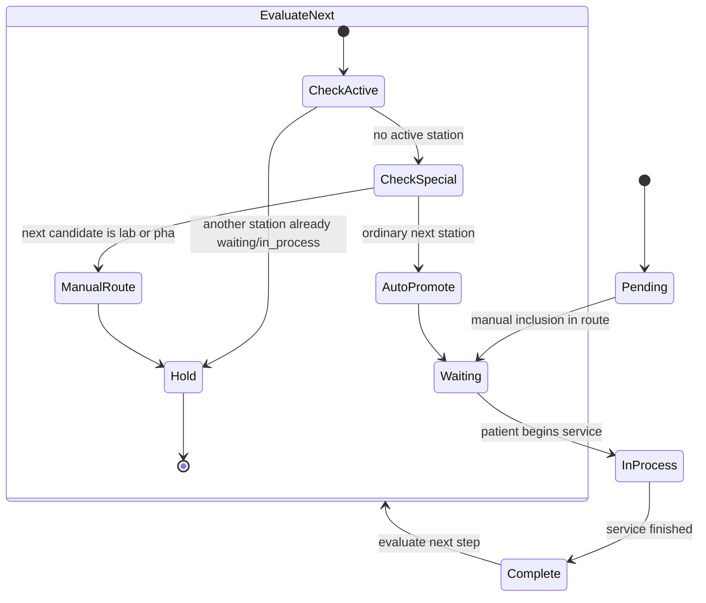

# Plan of Care State Machine

Clínica Alfarero --- Barcode Patient Flow System

This document shows the state machine for station progression within a
patient visit.

It reflects the current implementation approach and also highlights the
routing decision point after a station is completed.

---

## Purpose

This diagram is intended to help developers and clinic staff understand:

- the normal station state transitions
- when automatic promotion is allowed
- when manual promotion by the anfitrión is required
- where future routing improvements may be introduced

---

## State Machine Diagram

---

## State Definitions

### Pending

The station is not currently part of the active route.

### Waiting

The patient is ready and waiting for service at this station.

### InProcess

The patient is currently receiving service at this station.

### Complete

Service at this station has finished.

### EvaluateNext

This is a workflow decision point after a station completes.

It is not necessarily stored as a Firestore status.\
It represents backend logic that decides whether the route can advance
automatically.

### Hold

No automatic route advancement occurs.\
The visit remains unchanged until a human or later event advances it.

---

## Current Routing Logic Reflected Here

After a station changes from `in_process` to `complete`, the system
evaluates whether the next step should be auto-promoted.

Current behavior:

1.  If another station is already `waiting` or `in_process`, do not
    auto-promote.
2.  If the next candidate is `lab` or `pha`, do not auto-promote.
3.  Otherwise, auto-promote the next eligible station to `waiting`.

This mirrors the current pre-barcode-scanning implementation.

---

## Future Improvement Under Consideration

A more refined rule may be introduced later for `lab` and `pha`.

Proposed improvement:

- If only one of `lab` or `pha` is active in `plan_of_care`,
  auto-promotion could be allowed.
- If both are active, manual promotion by the anfitrión would still be
  required.

This has not yet been adopted in the current implementation.

---

## Notes for Backend Development

The barcode-driven event processor should stay aligned with the existing
visit-routing logic unless and until that logic is intentionally
refactored.

This means the state machine is both:

- a description of current behavior
- a reference point for future routing improvements

---
